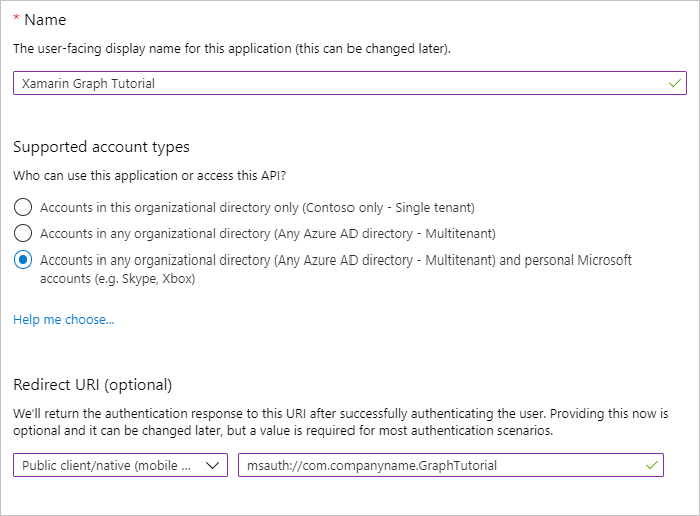
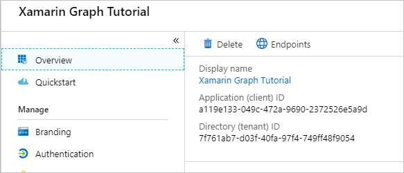

<!-- markdownlint-disable MD002 MD041 -->

In dieser Übung erstellen Sie eine neue Azure AD native-Anwendung mithilfe des Azure Active Directory Admin Center.In this exercise you will create a new Azure AD native application using the Azure Active Directory admin center.

1. Öffnen Sie einen Browser, und navigieren Sie zum [Azure Active Directory Admin Center](https://aad.portal.azure.com). Melden Sie sich mit einem **persönlichen Konto** (auch: Microsoft-Konto) oder einem **Geschäfts- oder Schulkonto** an.Open a browser and navigate to the [Azure Active Directory admin center](https://aad.portal.azure.com) and login using a **personal account** (aka: Microsoft Account) or **Work or School Account**.

1. Wählen Sie **Azure Active Directory** in der linken Navigationsleiste aus, und wählen Sie dann **App** -Registrierungen unter **Manage**aus.Select **Azure Active Directory** in the left-hand navigation, then select **App registrations** under **Manage**.

    

1. Wählen Sie **Neue Registrierung** aus.Select **New registration**. Legen Sie auf der Seite **Anwendung registrieren** die Werte wie folgt fest.On the **Register an application** page, set the values as follows.

    - Legen Sie **Name** auf `Xamarin Graph Tutorial` fest.Set **Name** to `Xamarin Graph Tutorial`.
    - Legen Sie **Unterstützte Kontotypen** auf **Konten in allen Organisationsverzeichnissen und persönliche Microsoft-Konten** fest.Set **Supported account types** to **Accounts in any organizational directory and personal Microsoft accounts**.
    - Lassen Sie **URI umleiten** leer.Leave **Redirect URI** empty.

    

1. Wählen Sie **Registrieren** aus.Choose **Register**. Kopieren Sie auf der Seite **Xamarin Graph Tutorial** den Wert der **Anwendungs-ID (Client)** , und speichern Sie ihn, dann benötigen Sie ihn im nächsten Schritt.On the **Xamarin Graph Tutorial** page, copy the value of the **Application (client) ID** and save it, you will need it in the next step.

    

1. Wählen Sie den Link Umleitungs- **URI hinzufügen** aus.Select the **Add a Redirect URI** link. Suchen Sie auf der Seite **URIs umleiten** nach dem Abschnitt Empfohlene Umleitungs- **URIs für öffentliche Clients (Mobil, Desktop)** .On the **Redirect URIs** page, locate the **Suggested Redirect URIs for public clients (mobile, desktop)** section. Wählen Sie den Anfang mit `msal` **und** den **urn: IETF: WG: OAuth: 2.0: OOB** URI aus.Select the URI that begins with `msal` **and** the **urn:ietf:wg:oauth:2.0:oob** URI. Kopieren Sie den Wert, der `msal`mit beginnt, und wählen Sie dann **Speichern**aus.Copy the value that begins with `msal`, then choose **Save**. Speichern Sie den kopierten Umleitungs-URI, den Sie im nächsten Schritt benötigen.Save the copied redirect URI, you will need it in the next step.

    